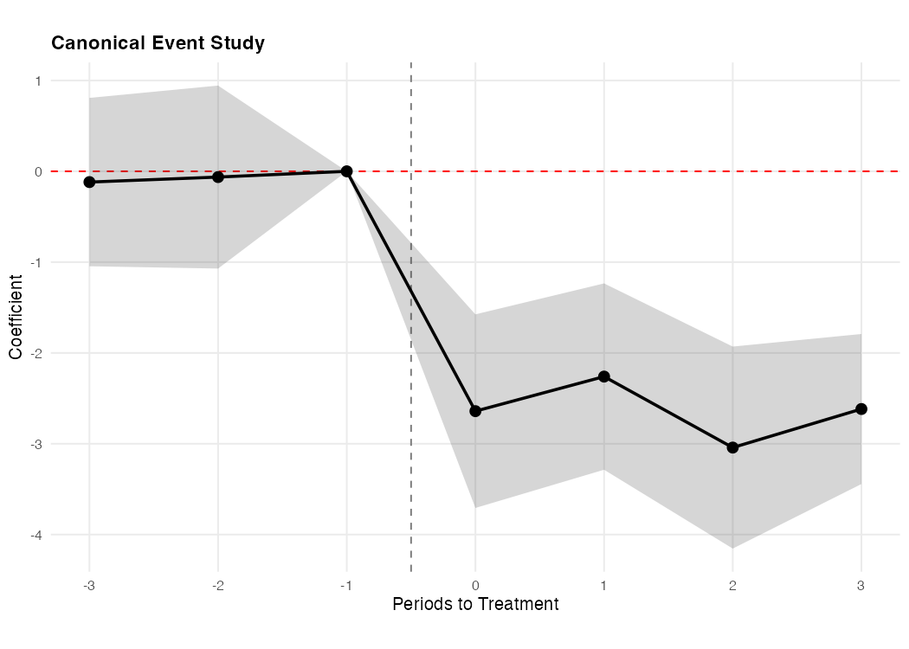
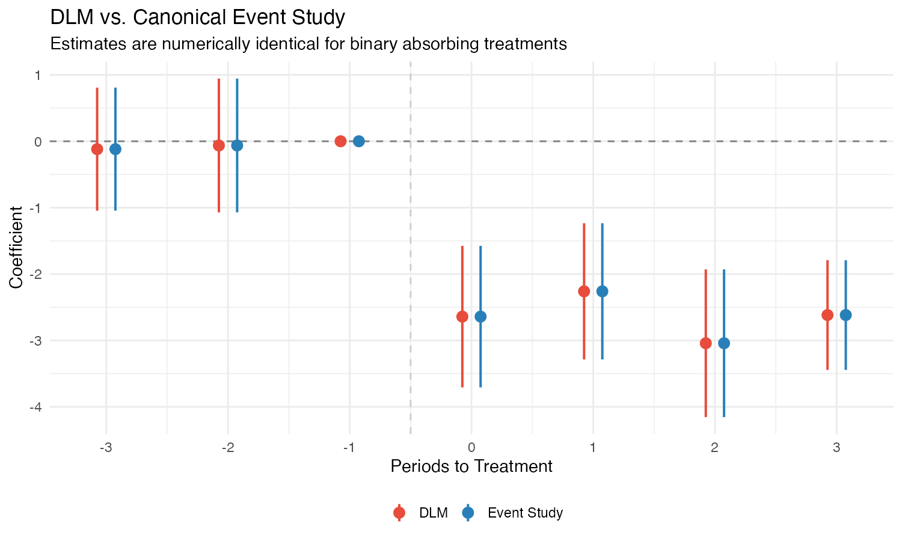

# Worked Example

This page walks through a complete analysis: we generate panel data, run both a **canonical event study** and a **DLM**, compare the results, and plot them. You can copy and paste the code directly into R or Stata.

## The Setup

We generate a balanced panel of 500 units observed over 20 time periods. About 40% of units receive treatment starting at time 7, 8, or 9 (randomly drawn). The true treatment effect is **−3**: after treatment onset, the outcome drops by 3 units on average.

Because treatment is binary and absorbing (turns on once and stays on), both the canonical event study and the DLM should produce **identical estimates**. This example demonstrates that.

## Step 1: Generate the Data

=== "R"

    ```r
    library(dlm)
    library(dplyr)
    library(ggplot2)

    # Generate test data (true effect = -3)
    df <- generate_data(seed = 42, n_groups = 500, n_times = 20, treat_prob = 0.4)

    # Separate outcome and exposure data (required by the R interface)
    outcome_data <- df %>% select(group, time, outcome)
    exposure_data <- df %>% select(group, time, post) %>% distinct()
    ```

=== "Stata"

    ```stata
    * Generate test data (true effect = -3)
    dlm_gen_data, n_groups(500) n_times(20) treat_prob(0.4) seed(42) clear
    ```

The generated data has columns `unit` (or `group`), `time`, `outcome`, `post` (binary treatment indicator), and `years_to_treatment` (event time, with −1000 for never-treated units).

## Step 2: Run the Canonical Event Study

First, we estimate a standard event study using binned-endpoint event-time dummies. This is the approach most researchers are familiar with: create dummy variables for each event-time period (e.g., $D_{-3}, D_{-2}, D_0, D_1, D_2, D_3$), omit the reference period ($t = -1$), and regress the outcome on these dummies with unit and time fixed effects.

The endpoints are "binned" — the $D_{-3}$ dummy equals 1 for all units at event time $-3$ **or earlier**, and $D_3$ equals 1 for all units at event time $3$ **or later**.

=== "R"

    ```r
    # Run a binned-endpoint event study
    es <- standard_twfe_for_comparison(
      data = df,
      from_rt = -3, to_rt = 3,
      outcome = "outcome",
      time = "time", unit = "group",
      time_to_treatment = "years_to_treatment",
      treat = "treat",
      ref_period = -1
    )

    # Event-study coefficients
    es$betas
    #                                     coef        se       tval         pval
    # time_to_treatment::-3+:treat -0.11846256 0.4729260 -0.2504886 8.023126e-01
    # time_to_treatment::-2:treat  -0.06327287 0.5139965 -0.1230998 9.020776e-01
    # time_to_treatment::0:treat   -2.64104056 0.5438700 -4.8560142 1.605193e-06
    # time_to_treatment::1:treat   -2.26029265 0.5234023 -4.3184616 1.896217e-05
    # time_to_treatment::2:treat   -3.04210098 0.5674556 -5.3609494 1.267789e-07
    # time_to_treatment::3+:treat  -2.61751913 0.4214689 -6.2104686 1.113671e-09
    ```

=== "Stata"

    ```stata
    * Determine the estimation window
    * The DLM uses observations in [min_time + to, max_time - (abs(from) - 1)]
    * With from=-3, to=3, times 1-20: estimation window is [4, 18]
    summarize time, meanonly
    local tlo = r(min) + 3
    local thi = r(max) - 2

    * Create binned event-time dummies
    gen byte es_m3 = (years_to_treatment <= -3) & (years_to_treatment != -1000)
    gen byte es_m2 = (years_to_treatment == -2)
    * ref = -1 is omitted
    gen byte es_0  = (years_to_treatment == 0)
    gen byte es_1  = (years_to_treatment == 1)
    gen byte es_2  = (years_to_treatment == 2)
    gen byte es_3  = (years_to_treatment >= 3) & (years_to_treatment != -1000)

    * Run the event study
    reghdfe outcome es_m3 es_m2 es_0 es_1 es_2 es_3 ///
        if (time >= `tlo') & (time <= `thi'), ///
        absorb(unit time) vce(cluster unit)

    * Save ES coefficients (dlm will overwrite e(b) in Step 3)
    matrix es_b = e(b)
    ```

    Output (abridged):

    ```
    HDFE Linear regression                            Number of obs   =      7,500
    Absorbing 2 HDFE groups                           F(   6,    499) =      25.67

                 |               Robust
         outcome | Coefficient  std. err.      t    P>|t|
    -------------+------------------------------------------------
           es_m3 |  -.0639588   .4835455    -0.13   0.895
           es_m2 |   .0946687   .4804238     0.20   0.844
            es_0 |  -2.763973   .4619066    -5.98   0.000
            es_1 |  -3.094282   .5204141    -5.95   0.000
            es_2 |  -2.707691   .5549396    -4.88   0.000
            es_3 |  -3.256921   .4261997    -7.64   0.000
    ```

    !!! note
        Stata and R use different random number generators, so `seed(42)` produces different data in each language. The coefficients differ numerically but the equivalence (DLM = event study) holds in both.

**Interpretation.** The pre-treatment coefficients at $t = -3$ and $t = -2$ are near zero, consistent with parallel trends. The post-treatment coefficients cluster around −2.3 to −3.3, matching the true effect of −3.

## Step 3: Run the DLM

Now we estimate the same relationship using the DLM. Instead of event-time dummies, the DLM regresses the outcome on **leads and lags of the treatment variable itself**, then transforms the resulting "gamma" coefficients into "beta" coefficients via cumulative summation. The betas have the same interpretation as event-study coefficients.

=== "R"

    ```r
    # Estimate DLM with event window [-3, 3]
    mod <- distributed_lags_model(
      data = outcome_data,
      exposure_data = exposure_data,
      from_rt = -3, to_rt = 3,
      outcome = "outcome", exposure = "post",
      unit = "group", time = "time"
    )

    # DLM beta coefficients
    mod$betas
    #            time_to_event        coef        se
    # post_lead2            -3 -0.11846256 0.4729260
    # post_lead1            -2 -0.06327287 0.5139965
    # post_lag0              0 -2.64104056 0.5438700
    # post_lag1              1 -2.26029265 0.5234023
    # post_lag2              2 -3.04210098 0.5674556
    # post_lag3              3 -2.61751913 0.4214689
    ```

=== "Stata"

    ```stata
    * Estimate DLM with event window [-3, 3]
    dlm outcome, exposure(post) unit(unit) time(time) from(-3) to(3)
    ```

    Output:

    ```
    ------------------------------------------------------------------------
    Distributed Lag Model (Schmidheiny & Siegloch 2023)
    ------------------------------------------------------------------------
      Outcome:    outcome
      Exposure:   post
      Window:     [-3, 3], ref = -1
      N obs:      7500
      N clusters: 500
    ------------------------------------------------------------------------

            Time        Coef          SE     95% CI lo     95% CI hi
    ------------------------------------------------------------------------
              -3   -0.063959    0.483545     -1.011708      0.883790
              -2    0.094669    0.480424     -0.846962      1.036299
              -1       (ref)           .             .             .
               0   -2.763973    0.461907     -3.669310     -1.858636
               1   -3.094282    0.520414     -4.114294     -2.074271
               2   -2.707691    0.554940     -3.795373     -1.620010
               3   -3.256921    0.426200     -4.092272     -2.421569
    ------------------------------------------------------------------------
    ```

The DLM betas are identical to the event-study coefficients from Step 2.

## Step 4: Verify Equivalence

Let's confirm the equivalence numerically.

=== "R"

    ```r
    # Compare DLM betas to event-study betas
    comparison <- data.frame(
      time = mod$betas$time_to_event,
      dlm_beta = mod$betas$coef,
      es_beta = es$betas$coef,
      difference = abs(mod$betas$coef - es$betas$coef)
    )
    print(comparison)
    #   time    dlm_beta     es_beta   difference
    # 1   -3 -0.11846256 -0.11846256 2.178119e-13
    # 2   -2 -0.06327287 -0.06327287 3.711059e-13
    # 3    0 -2.64104056 -2.64104056 3.312906e-13
    # 4    1 -2.26029265 -2.26029265 5.448975e-13
    # 5    2 -3.04210098 -3.04210098 3.108624e-14
    # 6    3 -2.61751913 -2.61751913 4.898304e-13

    cat("Max difference:", max(comparison$difference), "\n")
    # Max difference: 5.448975e-13
    ```

=== "Stata"

    ```stata
    * Save DLM results
    matrix dlm_b = e(betas)

    * Compare (es_b was saved in Step 2 before dlm overwrote e(b))
    display ""
    display "DLM vs Event Study Comparison:"
    display "  Period  DLM beta     ES beta      Difference"
    display "  ------  ----------   ----------   ----------"

    local periods  "-3 -2 0 1 2 3"
    local es_cols  "1 2 3 4 5 6"
    local dlm_rows "1 2 4 5 6 7"

    forvalues j = 1/6 {
        local p : word `j' of `periods'
        local c : word `j' of `es_cols'
        local r : word `j' of `dlm_rows'
        local dlm_coef = dlm_b[`r', 2]
        local es_coef = es_b[1, `c']
        local diff = abs(`dlm_coef' - `es_coef')
        display "  " %5.0f `p' "  " %10.6f `dlm_coef' "   " %10.6f `es_coef' "   " %10.2e `diff'
    }
    ```

    Output:

    ```
    DLM vs Event Study Comparison:
      Period  DLM beta     ES beta      Difference
      ------  ----------   ----------   ----------
         -3   -0.063959    -0.063959     1.24e-13
         -2    0.094669     0.094669     2.06e-13
          0   -2.763973    -2.763973     3.40e-13
          1   -3.094282    -3.094282     2.23e-13
          2   -2.707691    -2.707691     1.82e-13
          3   -3.256921    -3.256921     1.24e-13
    ```

**The estimates match to machine precision** (~$10^{-13}$). This confirms the theoretical result from Schmidheiny & Siegloch (2023): for a binary absorbing treatment, the DLM is a numerically identical reparametrization of the canonical binned-endpoint event study.

## Step 5: Plot the Results

Both approaches produce the same event-study plot — coefficients by event time, with the reference period normalized to zero.

First, we prepare the data for plotting by adding the reference period ($t = -1$, normalized to zero) back into each set of results:

=== "R"

    ```r
    # Add the reference period (t = -1, coef = 0) back in for plotting
    dlm_df <- data.frame(
      time_to_event = c(mod$betas$time_to_event, -1),
      coef = c(mod$betas$coef, 0),
      se = c(mod$betas$se, 0)
    )

    es_df <- data.frame(
      time_to_event = c(-3, -2, -1, 0, 1, 2, 3),
      coef = c(es$betas$coef[1:2], 0, es$betas$coef[3:6]),
      se = c(es$betas$se[1:2], 0, es$betas$se[3:6])
    )
    ```

=== "Stata"

    ```stata
    * Extract DLM results into a plotting dataset
    matrix b = e(betas)

    preserve
    clear
    local nr = rowsof(b)
    set obs `nr'
    gen time_to_event = .
    gen coef = .
    gen ci_lo = .
    gen ci_hi = .
    forvalues i = 1/`nr' {
        replace time_to_event = b[`i', 1] in `i'
        replace coef = b[`i', 2] in `i'
        replace ci_lo = b[`i', 4] in `i'
        replace ci_hi = b[`i', 5] in `i'
    }
    ```

Now plot the canonical event-study estimates:

=== "R"

    ```r
    p <- ggplot(es_df, aes(x = time_to_event, y = coef)) +
      geom_hline(yintercept = 0, lty = 2, color = "red") +
      geom_vline(xintercept = -0.5, lty = 2, color = "gray50") +
      geom_ribbon(aes(ymin = coef - 1.96 * se, ymax = coef + 1.96 * se),
                  alpha = 0.2, fill = "grey20") +
      geom_line(color = "black", linewidth = 0.8) +
      geom_point(color = "black", size = 2.5) +
      scale_x_continuous(breaks = -3:3) +
      labs(title = "Canonical Event Study",
           x = "Periods to Treatment", y = "Coefficient") +
      theme_minimal(base_size = 10) +
      theme(aspect.ratio = 0.6,
            plot.title = element_text(size = 11, face = "bold", hjust = 0),
            panel.grid.minor = element_blank())
    ggsave("event_study.png", p, width = 7, height = 5)
    ```

=== "Stata"

    ```stata
    * (Using the ES coefficients stored in _b[] from Step 2)
    * Plot follows the same pattern as the DLM plot below
    ```

{ width="600" }

And the DLM estimates:

=== "R"

    ```r
    p <- ggplot(dlm_df, aes(x = time_to_event, y = coef)) +
      geom_hline(yintercept = 0, lty = 2, color = "red") +
      geom_vline(xintercept = -0.5, lty = 2, color = "gray50") +
      geom_ribbon(aes(ymin = coef - 1.96 * se, ymax = coef + 1.96 * se),
                  alpha = 0.2, fill = "grey20") +
      geom_line(color = "black", linewidth = 0.8) +
      geom_point(color = "black", size = 2.5) +
      scale_x_continuous(breaks = -3:3) +
      labs(title = "Distributed Lag Model",
           x = "Periods to Treatment", y = "Coefficient") +
      theme_minimal(base_size = 10) +
      theme(aspect.ratio = 0.6,
            plot.title = element_text(size = 11, face = "bold", hjust = 0),
            panel.grid.minor = element_blank())
    ggsave("dlm.png", p, width = 7, height = 5)
    ```

=== "Stata"

    ```stata
    dlm_plot, title("Event-Study Plot") xtitle("Periods to Treatment") ytitle("Coefficient")
    restore
    drop es_*
    ```

{ width="600" }

The two plots are identical. We can overlay them to confirm:

=== "R"

    ```r
    combined_df <- rbind(
      dlm_df %>% mutate(method = "DLM"),
      es_df %>% mutate(method = "Event Study")
    )

    p <- ggplot(combined_df, aes(x = time_to_event, y = coef, color = method)) +
      geom_hline(yintercept = 0, linetype = "dashed", color = "gray50") +
      geom_vline(xintercept = -0.5, linetype = "dashed", color = "gray80") +
      geom_pointrange(aes(ymin = coef - 1.96 * se, ymax = coef + 1.96 * se),
                      position = position_dodge(width = 0.3),
                      size = 0.7, linewidth = 0.9) +
      scale_color_manual(values = c("DLM" = "#e74c3c", "Event Study" = "#2980b9")) +
      scale_x_continuous(breaks = -3:3) +
      labs(title = "DLM vs. Canonical Event Study",
           subtitle = "Estimates are numerically identical for binary absorbing treatments",
           x = "Periods to Treatment", y = "Coefficient", color = "") +
      theme_minimal(base_size = 14) +
      theme(legend.position = "bottom")
    ggsave("combined.png", p, width = 10, height = 6)
    ```

{ width="600" }

Flat pre-trends near zero, then a sharp drop to around −2.6 at treatment onset — consistent with the true effect of −3. The DLM (red) and event study (blue) estimates are numerically identical.

## Why This Matters

This example uses a binary absorbing treatment — the special case where the canonical event study works. Both approaches give the same answer, so why bother with DLMs?

The DLM's advantage appears when the treatment is **continuous** — e.g., a tax rate that changes from 0% to 5% to 8.5%, a minimum wage that increases in steps, or a policy dosage that varies across units and over time. In those settings, you can't create event-time dummies (there is no single "event"), but the DLM's lead/lag framework handles it naturally. See the [Theory](../theory/background.md) page for a concrete illustration with continuous treatment data.
