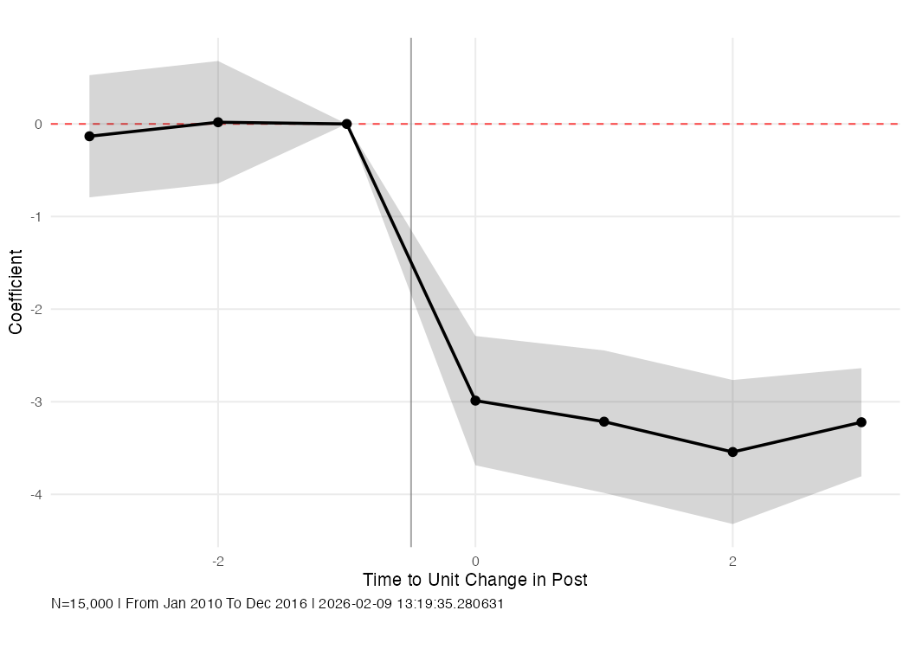
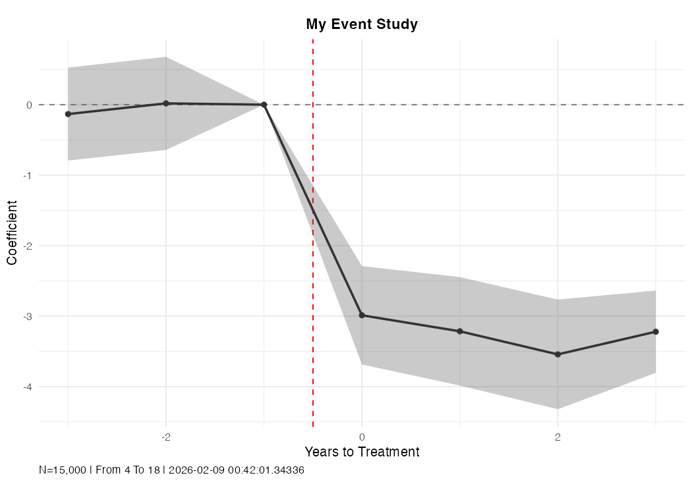

# R Guide

## Basic Usage

```r
library(dlm)

mod <- distributed_lags_model(
  data = outcome_data,
  exposure_data = treatment_data,
  from_rt = -3, to_rt = 3,
  outcome = "y", exposure = "treated",
  unit = "id", time = "year"
)
```

The R version takes **separate data frames** for outcomes and exposure. This is useful when the exposure is defined at a different level (e.g., pharmacy-level treatment merged onto beneficiary-level outcomes).

## Data Setup

The R DLM expects two data frames:

1. **`data`** — contains unit, time, outcome, and any covariates
2. **`exposure_data`** — contains unit, time, and the exposure variable (one row per unit-time)

```r
library(dlm)
library(dplyr)

# Example: separate outcome and exposure data
outcome_data <- full_data %>% select(id, year, y, x1, x2)
exposure_data <- full_data %>% select(id, year, treated) %>% distinct()
```

If your data is a single data frame, just select the relevant columns:

```r
df <- generate_data(seed = 42)

data <- df %>% select(group, time, outcome)
exposure_data <- df %>% select(group, time, post) %>% distinct()
```

## Examples

### Basic estimation

```r
library(dlm)
library(dplyr)

df <- generate_data(seed = 42, n_groups = 500, n_times = 20, treat_prob = 0.4)

data <- df %>% select(group, time, outcome)
exposure_data <- df %>% select(group, time, post) %>% distinct()

mod <- distributed_lags_model(
  data = data,
  exposure_data = exposure_data,
  from_rt = -3, to_rt = 3,
  outcome = "outcome", exposure = "post",
  unit = "group", time = "time"
)

mod$betas
```

Output:

```
           time_to_event        coef        se
post_lead2            -3 -0.11846256 0.4729260
post_lead1            -2 -0.06327287 0.5139965
post_lag0              0 -2.64104056 0.5438700
post_lag1              1 -2.26029265 0.5234023
post_lag2              2 -3.04210098 0.5674556
post_lag3              3 -2.61751913 0.4214689
```

### Custom reference period

```r
mod <- distributed_lags_model(
  data = data,
  exposure_data = exposure_data,
  from_rt = -3, to_rt = 3,
  outcome = "outcome", exposure = "post",
  unit = "group", time = "time",
  ref_period = -2
)
```

### With covariates

```r
data_with_covs <- df %>% select(group, time, outcome, x1, x2)

mod <- distributed_lags_model(
  data = data_with_covs,
  exposure_data = exposure_data,
  from_rt = -3, to_rt = 3,
  outcome = "outcome", exposure = "post",
  unit = "group", time = "time",
  covariates = c("x1", "x2")
)
```

### Additional fixed effects

```r
mod <- distributed_lags_model(
  data = data,
  exposure_data = exposure_data,
  from_rt = -3, to_rt = 3,
  outcome = "outcome", exposure = "post",
  unit = "group", time = "time",
  addl_fes = c("region")
)
```

### Multiple outcomes

Use `distributed_lags_models` (plural) to estimate multiple outcomes:

```r
mods <- distributed_lags_models(
  data = data,
  exposure_data = exposure_data,
  from_rt = -3, to_rt = 3,
  outcomes = c("outcome1", "outcome2"),
  exposure = "post",
  unit = "group", time = "time"
)

# Access each model
mods[[1]]$betas
mods[[2]]$betas
```

### Weighted regression

```r
mod <- distributed_lags_model(
  data = data,
  exposure_data = exposure_data,
  from_rt = -3, to_rt = 3,
  outcome = "outcome", exposure = "post",
  unit = "group", time = "time",
  weights = "pop_weight"
)
```

## Working with Results

The returned object is a list:

```r
names(mod)
# [1] "betas" "plot" "model" "vcov" "data_periods_included"
# [6] "fmla_str" "from_rt" "to_rt" "exposure" "outcome"
```

### Beta coefficients

```r
mod$betas
#            time_to_event        coef        se
# post_lead2            -3 -0.11846256 0.4729260
# post_lead1            -2 -0.06327287 0.5139965
# post_lag0              0 -2.64104056 0.5438700
# post_lag1              1 -2.26029265 0.5234023
# post_lag2              2 -3.04210098 0.5674556
# post_lag3              3 -2.61751913 0.4214689
```

### Built-in event-study plot

```r
mod$plot
```

{ width="600" }

The plot is a `ggplot2` object. Customize it further:

```r
mod$plot +
  ggplot2::labs(title = "My Event Study", x = "Years to Treatment")
```

You can also use `time_labels` to map time period values to readable labels in the caption:

```r
mod <- distributed_lags_model(
  ..., time_labels = c("4" = "Jan 2010", "18" = "Dec 2016")
)
# Caption will show "From Jan 2010 To Dec 2016" instead of "From 4 To 18"
```

{ width="600" }

### Access the underlying fixest model

```r
summary(mod$model)
fixest::coeftable(mod$model)
```

## Test Data Generator

```r
df <- generate_data(seed = 42, n_groups = 500, n_times = 20, treat_prob = 0.4)
```

| Argument | Default | Description |
|---|---|---|
| `seed` | 1234 | Random seed |
| `n_groups` | 676 | Number of panel units |
| `n_times` | 20 | Number of time periods |
| `treat_prob` | 0.4 | Treatment probability |

Key variables: `group`, `time`, `treat`, `treatment_time`, `years_to_treatment`, `post`, `outcome`.
